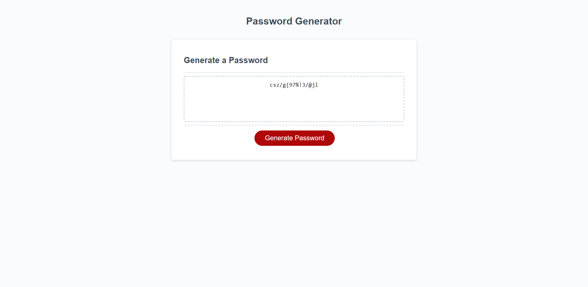

# 03-Homework-PWGenerator
##Collaborators
Rodin Grajado gave me a tip about treating strings as arrays that helped me figure out how to do all the character limiting stuff

First, I defined all the global variables at the top. 

There are separate variables for each type of character the generator needs to prompt the user about, so that they can be removed from the list of possible characters if the user doesn't want them.

There are also boolean variables for each one so the if statements can check for true or false based on user input from window.confirm and then remove or keep character sets as appropriate

I also declared the allchars variable to store the concatenated variables based on the previously mentioned user input.

pwLength is declared so it can be adjusted later based on user input from window.prompt
password is also declared so it could be used in multiple functions rather than just locally

Next, all the functions happen. The script contains the following functions:

-a function to clear the textbox before anything else happens, so the button can be re-used without adding new passwords onto old ones
-a function to prompt the user for the pw length
-a function to prompt the user for which types of characters to use, and to limit the available pool of characters based on their input. This works by adding the variables containing each type of character into the allchars variable if the boolean operators from user input for that type of character is true. If they don't choose any type of character, it starts over so they have to put something.
-a function to generate the actual password. It uses a for loop to add a character from the allchars pool of available characters by using a random number to reference a matrix element from allchars, and it repeats until it gets to the correct password length
-a function to actually write the password onto the page. this was provided in the file

Then, there are several evenlisteners for when the user clicks generate password. It calls each function in order to clear the textbox, prompt for length, prompt for type of characters, to generate the actual password, and to write the password into the text box.

